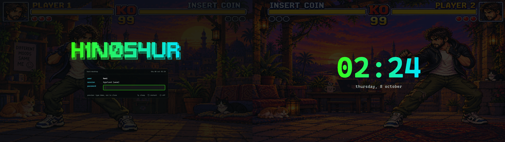
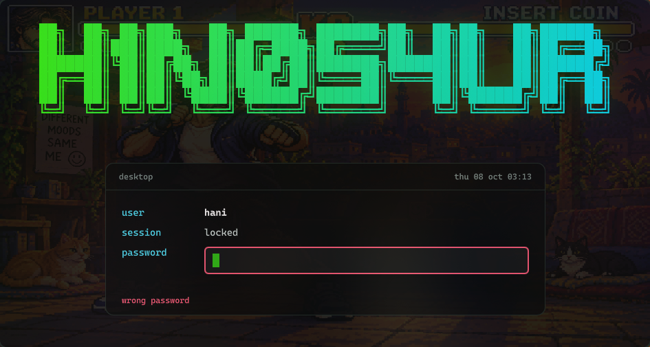
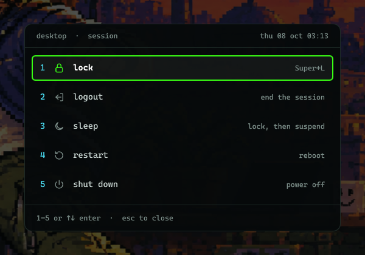
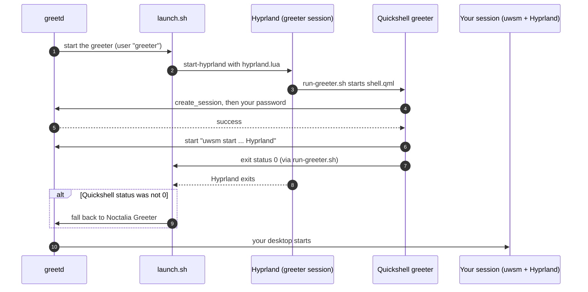

# h1n054ur login, lock screen and session menu

A login screen for [greetd](https://sr.ht/~kennylevinsen/greetd/), a lock screen and a session menu, all built with [Quickshell](https://quickshell.org) and sharing one design: the H1N054UR banner and a terminal-style panel on the main screen, a big clock on the other.



## Two screens

The left-most screen is the main one: it gets the banner and the panel where you type your password. Every other screen shows the time and date, centred. On a single screen you get the panel only. Screens are told apart by their position, and the greeter's Hyprland places them from `greeter/monitors.lua` (see below), so the roles stay the same however the cables are plugged in.

| | Left screen (main) | Other screens |
|---|---|---|
| Login | banner, user, session, password | clock and date |
| Lock | banner, user, password | clock and date |
| Session menu | opens on the screen you are using | dimmed |

## Lock screen

Super+L, or after 10 minutes idle, and always before the machine sleeps (hypridle). Your password unlocks it through PAM. A wrong password stays on screen in red and you try again. There are no sleep or power buttons on the lock screen, so nothing can suspend a locked session by accident.



## Session menu

Super+Alt+C, or the power icon on the bar. Keys 1 to 5 (or arrows and Enter) pick lock, log out, sleep, restart or shut down. Sleep, restart and shut down count down 3 seconds, and Esc cancels.



## How a login works



Hyprland crashes while exiting on some NVIDIA setups ([aquamarine#430](https://github.com/hyprwm/aquamarine/issues/430)), so `launch.sh` decides by Quickshell's exit status, not Hyprland's. If the greeter ever fails to start, you get Noctalia Greeter instead of a dead screen.

## What's here

| Path | What |
|---|---|
| `greeter/shell.qml` | the greeter: talks to greetd, one window per screen |
| `greeter/LoginScreen.qml`, `ClockScreen.qml` | the two screens, reused by the lock screen |
| `greeter/hyprland.lua` | the minimal Hyprland the greeter runs in |
| `greeter/monitors.example.lua` | copy to `monitors.lua` with your screens (kept out of git: it holds serials) |
| `greeter/launch.sh`, `run-greeter.sh` | what greetd starts, with logging and the fallback |
| `greeter/install.sh` | `install`, `enable`, `revert` (run with sudo) |
| `greeter/assets/` | the banner and icons |
| `shell/shell.qml` | the lock screen and session menu, with IPC for keybinds |
| `shell/tests/nested.sh` | tests the lock screen in a nested Hyprland window |

## Install

Needs greetd, Quickshell 0.3 and Hyprland 0.55 or newer (Lua config).

```sh
git clone https://github.com/h1n054ur/quickshell-h1n054ur ~/quickshell-h1n054ur
cd ~/quickshell-h1n054ur/greeter
cp monitors.example.lua monitors.lua      # fill in your screens from hyprctl monitors
sudo ./install.sh install                 # copies to /etc/greetd/h1n054ur, records your user
sudo ./install.sh enable                  # makes it the login screen; reboot to see it
```

For the lock screen and menu, link the shell and start it with your session:

```sh
ln -s ~/quickshell-h1n054ur/shell ~/.config/quickshell/h1n054ur
quickshell -c h1n054ur ipc call lock lock        # Super+L
quickshell -c h1n054ur ipc call session toggle   # Super+Alt+C
```

Use hypridle with `before_sleep_cmd = quickshell -c h1n054ur ipc call lock lock` so the screen locks before sleep, and turn off any other locker (two lockers fighting over the screen crash each other).

## Testing safely

Never test a lock screen or greeter on your live session. `shell/tests/nested.sh deny` and `allow` lock a nested Hyprland window with a test PAM file and check that a wrong password keeps it locked and a right one unlocks it. To undo the login screen: `sudo ./install.sh revert`. From a text console (Ctrl+Alt+F3) that always works.

## Part of h1n054ur/desktop

This repo is generated from the `quickshell/` folder of [h1n054ur/desktop](https://github.com/h1n054ur/desktop). It is read-only: open issues and pull requests there.

## Licence

MIT, see [LICENSE](LICENSE).
